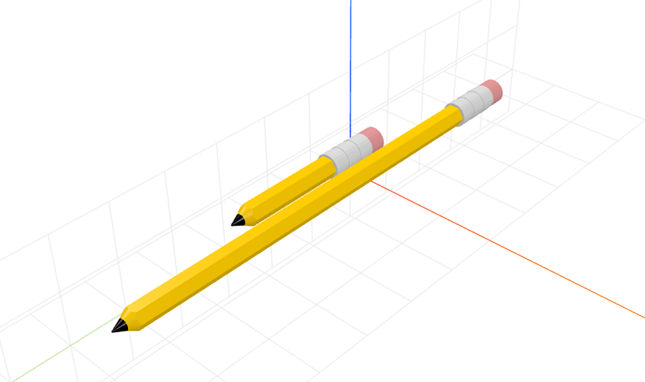

# craft-pencil

Parameterized pencil model.

### Install
	$ npm install craft-pencil

### Parameters
- size: scales model
- length: adjusts length of pencil

### Examples
```html
<craft>
    <craft name="pencil" module="craft-pencil"/>
    <pencil size="2" length="20"></pencil>
    <pencil length="40"></pencil>
    <pencil></pencil>
</craft>
```

